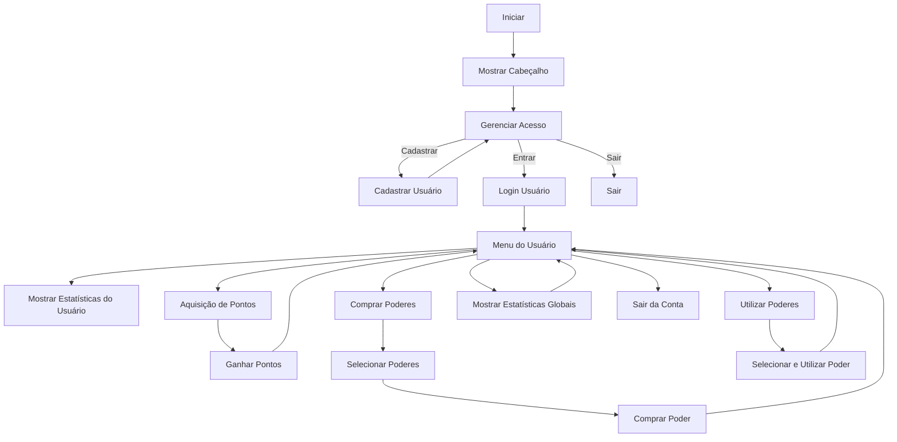

# VV-Points

## Descrição
O VV-Points é um sistema simples de controle de usuários, que permite cadastro, login, aquisição de pontos e compra de poderes especiais. Ele utiliza um banco de dados local para gerenciar informações dos usuários, como nome, senha (armazenada de forma segura com hash), pontos acumulados e poderes adquiridos.

## Funcionalidades
- **Cadastro de Usuário**: Permite que novos usuários se cadastrem no sistema.
- **Login Seguro**: Autentica usuários com senha.
- **Acúmulo de Pontos**: Usuários podem ganhar pontos ao realizar ações, como convidar amigos ou assistir a eventos.
- **Compra de Poderes**: Possibilidade de adquirir poderes especiais com os pontos acumulados.
- **Utilização de Poderes**: Usuários podem usar os poderes adquiridos.
- **Estatísticas de Usuários**: Visualiza pontos e poderes dos usuários cadastrados.

## Diagrama


## Pré-requisitos
- Python 3.x
- Bibliotecas: `webbrowser`, `hashlib`, `tabulate`

## Como Usar
1. **Clone o repositório**

2. **Execute o script**:
   ```bash
   python main.py
   ```

3. **Interaja com o menu**:
   - Escolha entre cadastrar um novo usuário, fazer login, ou sair.
   - Após o login, você poderá acumular pontos, comprar e utilizar poderes.

## Segurança
- A senha dos usuários é armazenada em formato hash utilizando SHA-256, proporcionando uma camada adicional de segurança.

## Contato
Projeto desenvolvido por:
- Eduardo Fakiani (RM556093)
- Fernanda Rocha Menon (RM554673)
- Luiza Macena Dantas (RM556237)
- Gabriel Alves Machado Vara (RM555355)
- Leonardo Correa de Mello (RM555573)